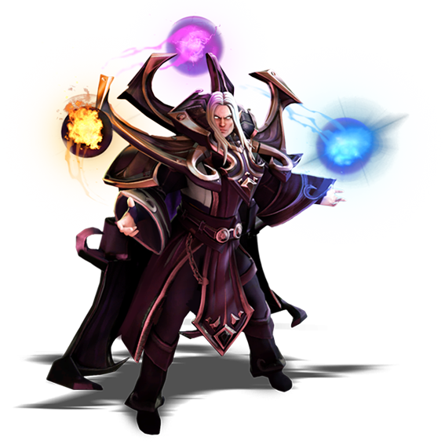

Dota 2 is a multiplayer online battle arena (MOBA) video game developed by Valve Corporation, and is one of the most actively played games on Steam. Dota 2 is played in matches between two five-player teams, each of which occupies a base in a corner of the playing field. Each player controls one of 111 playable characters, called "heroes", which feature unique abilities. During a match, the player collects gold and experience points for their hero, while fighting heroes of the opposite team. The gold can be used to purchase items from stores. A team wins by destroying the other side's "Ancient" building, located within the opposing base.


Invoker is one of the most played heroes in Dota 2 because of his uniqueness: he has a maximum of 10 combat abilities instead of 4, which is the number of abilities that other heroes commonly have. However, these abilities can only be used after being invoked. 



Invoker has 3 basic abilities (orbs), Quas, Wex, Exort, and his ultimate, Invoke. 


 
 

He can use these abilities to invoke the 10 combat abilities. Invoker can have at most 3 orbs surrounding him, and depending on the combinations of the orbs (number of different combinations = 3+3x2+1 = 10), he can invoke different combat abilities. Another limitation is that Invoker can only keep at most 2 combat abilities simultaneously. 

The goal of this project is to explore factors that are associated with the winning rate in games that have Invoker, and ultimately to build a model that can be used to predict if a game was won according to these factors.

Data were collected using the official API between March 1st and April 4th, 2016. Inclusion criteria are: (1) "Very High" skill bracket; (2) no leavers; (3) game length greater than 10 min; (4) game mode in ("All pick", "Captain mode", "Ranked all pick"). 

I've examined two questions so far: 

##### 1. Which heroes as teammates led to highest winning rate? 
Which heroes as opponents led to lowest winning rate?

I calculated the numbers of games that each hero was played with Invoker as a teammate or an opponent, and calculated the winning rate for each of the heroes.

##### 2. Which build led to higher winning rate for invoker?

Since Invoker can keep only two combat abilities simultaneously and it takes more time to invoke other abilities at early game, it is wiser to focus on two basic skills out of the three (Quas, Wex, Exort) to upgrade. Therefore we have different "builds" for an Invoker player: "Quas-Exort", "Quas-Wex" or "Wex-Exort". More specifically, current Invoker players usually only use the first two builds. I compared the winning rate across different builds in this analysis.

My ultimate goal is to build a prediction model that harnesses information like those explored so far. I am thinking of using logistic regression and gradient boosted trees (as implemented in the "xgboost" package) to do this. The targeted metric is accuracy, given that the data is quite balanced (winning rate ~ 50%). I am going to divide the data into 10 cross-validation folds, and select my final model based on the CV error.


####Load packages.
```{r load packages,message=FALSE}
suppressWarnings(library(dplyr))
suppressWarnings(library(tidyr))
suppressWarnings(library(RCurl))
suppressWarnings(library(jsonlite))
suppressWarnings(library(RSQLite))
suppressWarnings(library(ggplot2))
suppressWarnings(library(png))
suppressWarnings(library(grid))
suppressWarnings(library(gridExtra))
```

  
####Load my Steam key. 
In order to use Dota2 API, you need to have a Steam account and [apply for a key](https://steamcommunity.com/dev).

```{r}
steam_key=readRDS(file="E:/dota_data/steam_key.rds")
```


####Load data from SQLite database.
```{r sql,cache=TRUE}
db = dbConnect(SQLite(), "D:/DataSci_tools/Git_Repo/bak/dota_6.86f.sqlite3")

match = dbReadTable(db,'match')    #match info
player = dbReadTable(db,'player')    #player info for each match
ability_up = dbReadTable(db,'ability_up')    #ability upgrade information for each player

dbDisconnect(db)
```


####Quick look at the datasets
```{r data info}
head(match)
head(player,10)
head(ability_up)
```


####Acquire a list of heros using the API.
```{r}
inv_id=74    # invoker, http://api.steampowered.com/IEconDOTA2_205790/GetHeroes/v0001/?language=en&key=steam_key

hero_json = fromJSON(getURL(paste0("http://api.steampowered.com/IEconDOTA2_205790/GetHeroes/v0001/?language=en&key=",steam_key)))
hero_names = gsub('npc_dota_hero_','',hero_json$result$heroes$name)
hero_names = data.frame(id = hero_json$result$heroes$id,name = hero_names,stringsAsFactors = F)
head(hero_names)
```

Subset the dataset for those that had Invoker.

```{r subset}
inv_matchid = filter(player,hero_id==inv_id) %>% select(match_id) %>% unlist

inv_match = filter(match,match_id%in%inv_matchid)
inv_player = filter(player,match_id%in%inv_matchid)
inv_ability = filter(ability_up,match_id%in%inv_matchid)

dim(inv_match)
```


### Q1. Which heroes as teammates led to highest winning rate? 

```{r,cache=TRUE}
#summarize heros info for each game, spread rows to columns
game_info = inv_player %>% select(match_id,player_slot,hero_id) %>% mutate(team = ifelse(player_slot<5,'radiant','dire')) %>%
    group_by(match_id,team) %>%
    mutate(has_invoker= any(hero_id==inv_id),count=1)

inv_ally = game_info %>% filter(has_invoker) %>% select(-player_slot) %>%
    spread(key = hero_id,value = count,fill = 0)
names(inv_ally)[-(1:3)] = paste0('ally_',names(inv_ally)[-(1:3)])

inv_ally = inv_ally %>% group_by(match_id,team) %>% summarise_each_(funs(mean(.,na.rm=T)),names(inv_ally)[-(1:3)]) %>% select(-ally_74)  #remove invoker from the ally list


inv_enemy = game_info %>% filter(!has_invoker) %>% select(-player_slot) %>%
    spread(key = hero_id,value = count,fill = 0)
names(inv_enemy)[-(1:3)] = paste0('enemy_',names(inv_enemy)[-(1:3)])

inv_enemy = inv_enemy %>% group_by(match_id,team) %>% summarise_each_(funs(mean(.,na.rm=T)),names(inv_enemy)[-(1:3)]) %>% select(-team)

game_info_sum = inner_join(inv_ally,inv_enemy,by='match_id')


#combine
match_info_comb = inner_join(match,game_info_sum,by='match_id')

inv_win = match_info_comb %>% select(match_id,radiant_win,team,ally_1:enemy_113) %>% 
    filter((radiant_win&team=='radiant') | (!radiant_win&team!='radiant')) %>%
    summarise_each_(funs(sum),vars=c(names(inv_ally)[-(1:3)],names(inv_enemy)[-(1:3)]))


#total number of games for each hero
game_totalN = match_info_comb %>% summarise_each_(funs(sum),vars=c(names(inv_ally)[-(1:3)],names(inv_enemy)[-(1:3)]))


inv_ally_win = t(select(inv_win,starts_with('ally'))/select(game_totalN,starts_with('ally')))
inv_ally_win = data.frame(number = row.names(inv_ally_win),win_freq = inv_ally_win,totalN = unlist(select(game_totalN,starts_with('ally'))),group='ally')
inv_ally_win = inv_ally_win[order(inv_ally_win$win_freq,decreasing = T),]


inv_enemy_win = t(select(inv_win,starts_with('enemy'))/select(game_totalN,starts_with('enemy')))
inv_enemy_win = data.frame(number = row.names(inv_enemy_win),win_freq = inv_enemy_win,totalN = unlist(select(game_totalN,starts_with('enemy'))),group='enemy')
inv_enemy_win = inv_enemy_win[order(inv_enemy_win$win_freq),]
```


```{r,fig.height=6,fig.width=6}
p1_data = rbind(inv_ally_win[1:10,],inv_enemy_win[10:1,]) %>% mutate(id = as.integer(gsub('.*_','',number))) %>% inner_join(hero_names,by='id')
p1_data = p1_data %>% mutate(name_f = ifelse(group=='ally',paste0(name,'_a'),paste0(name,'_e')))    #add suffix
p1_data$name_f <- factor(p1_data$name_f, levels = p1_data$name_f[order(p1_data$win_freq,decreasing = T)])
ggplot(aes(x=name_f,y=win_freq,fill=group),data=p1_data) + geom_hline(yintercept=0.5,col='blue',linetype='dashed') +
    geom_bar(stat = "identity") +
    labs(title = "Plot 1. Max/min winning rate with allies/enemies") + xlab("Heros") + ylab("Winning rate")
```

Invoker had the highest winning rate with these ally heroes (high to low)

```{r,fig.height=0.8,fig.width=10,echo=FALSE}
imgs = list()
for(i in 1:10){
    imgs[[i]] = rasterGrob(readPNG(paste0('D:/DataSci_tools/Git_Repo/dota2/205x115/',p1_data$name[i],'_lg.png')), interpolate=TRUE, width = unit(0.95,"in"),height=unit(0.6,"in"))
}
grid.arrange(grobs=imgs,nrow=1)
```

Invoker had the lowest winning rate with these enemy heroes (low to high)

```{r,fig.height=0.8,fig.width=10,echo=FALSE}
imgs = list()
for(i in 1:10){
    imgs[[i]] = rasterGrob(readPNG(paste0('D:/DataSci_tools/Git_Repo/dota2/205x115/',p1_data$name[21-i],'_lg.png')), interpolate=TRUE, width = unit(0.95,"in"),height=unit(0.6,"in"))
}
grid.arrange(grobs=imgs,nrow=1)
```


### Q2. Which build led to higher winning rate for invoker?

```{r,cache=TRUE}
inv_slot = inv_player %>% filter(hero_id==inv_id) %>% select(match_id,player_slot)
inv_ability_only = inner_join(inv_ability,inv_slot,by=names(inv_slot))

inv_ab_lvl9  = inv_ability_only %>% group_by(match_id) %>%
    mutate(lvl_max = max(level)) %>% filter(lvl_max>10,level<10) %>%
    group_by(match_id,ability) %>% tally %>% spread(key=ability,value=n,fill=0)

names(inv_ab_lvl9) = c('match_id','quas','wex','exort','invoke')
head(inv_ab_lvl9)

inv_ab_lvl9 = inv_ab_lvl9 %>% mutate(inv_class=ifelse(wex<=1,'Quas_Exort',ifelse(exort<=1,'Quas_Wex',ifelse(quas<=1,'Wex_Exort','other'))))
table(inv_ab_lvl9$inv_class)
filter(inv_ab_lvl9,inv_class=='other')


match_info_comb = inner_join(match_info_comb,inv_ab_lvl9,by='match_id')

inv_win_class = match_info_comb %>% select(match_id,radiant_win,team,inv_class) %>%
    mutate(inv_win = (radiant_win&team=='radiant') | (!radiant_win&team!='radiant')) %>%
    group_by(inv_class,inv_win) %>% tally %>% group_by(inv_class) %>% mutate(total_n = sum(n),freq=n/total_n) %>%
    filter(inv_win)
```


```{r,fig.height=6,fig.width=6}
inv_win_class
ggplot(aes(x=inv_class,y=freq),data=inv_win_class) + geom_hline(yintercept=0.5,col='blue',linetype='dashed') + 
    geom_bar(stat = "identity") +
    labs(title = "Plot 2. Winning rate for different Inoker builds") + xlab("Build") + ylab("Winning rate")
```

